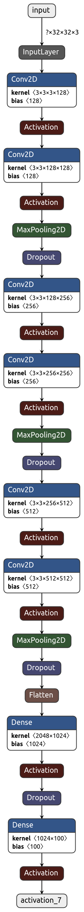

# CNN based classifier for CIFAR100 Data  

CIFAR100 is the collection of over 60,000 images, belonging to 100 different classes. The 100 classes in the CIFAR-100 are grouped into 20 superclasses. Each image comes with a "fine" label (the class to which it belongs) and a "coarse" label (the superclass to which it belongs).  
The CIFAR100 dataset can be downloaded from this [link](https://www.cs.toronto.edu/~kriz/cifar.html)  

## Model overview  
|  |
|:--:| 

## Results  
The test input image `sample_image.jpeg` contained a beaver, and `sample_image2.jpeg` contained a train, which were correctly predicted by the network as 42, and 48, which are the class labels for beaver and train respectively.  
### Test input images  
  

