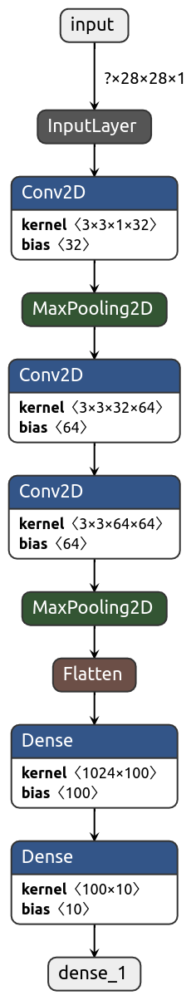

# Simple CNN based classifier for MNIST data  
Modified National Institute of Standards and Technology dataset abbrevated as MNIST is the collection of images of hand-written digits. 
These are over 60,000 images in grayscale and of size 28*28 pixels.   
More info about MNIST dataset on [Wiki](https://en.wikipedia.org/wiki/MNIST_database)  
## Model overview  
|  |
|:--:| 

## Results  
The test input image `smaple_image.png` contained the letter 7, and the model correctly predicted the number as 7.      
### Test image

