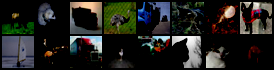
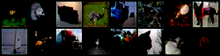
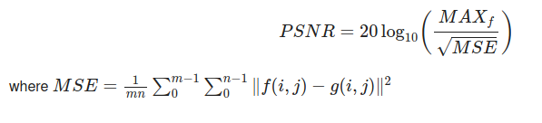
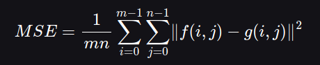
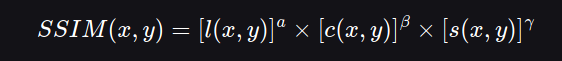
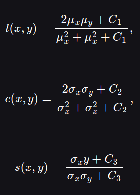
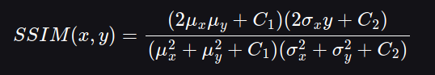

# Convolutional Autoencoder
This CNN based classifier network was trained on [CIFAR10 Dataset](https://www.cs.toronto.edu/~kriz/cifar.html)  
Learn more about [autoencoders](https://github.com/lucciffer/Basic-Networks-And-Architectures#convolutional-autoencoder)   
The Autoencoder network was trained on CIFAR10 dataset, for 100 epochs and results were obtained.  

## Results  
### Original image samples from the dataset  

     

### Reconstructed image from the network    

  

### Peak-Signal-to-Noise Ratio(PSNR)  
The term peak signal-to-noise ratio (PSNR) is an expression for the ratio between the maximum possible value (power) of a signal and the power of distorting noise that affects the quality of its representation.  Because many signals have a very wide dynamic range, (ratio between the largest and smallest possible values of a changeable quantity) the PSNR is usually expressed in terms of the logarithmic decibel scale.  
PSNR is given as: 

  

**PSNR for the designed Convolutional Autoencoder was 35.94dB  ** 

### Structural Similarity Index(SSIM)  
The Structural Similarity Index (SSIM) is a perceptual metric that quantifies the image quality degradation that is caused by processing such as data compression or by losses in data transmission. This metric is basically a full reference that requires 2 images from the same shot, this means 2 graphically identical images to the human eye. The second image generally is compressed or has a different quality, which is the goal of this index. SSIM is usually used in the video industry, but has as well a strong application in photography. SIM actually measures the perceptual difference between two similar images. It cannot judge which of the two is better: that must be inferred from knowing which is the original one and which has been exposed to additional processing such as compression or filters.  

We know Mean Squared Error(MSE) is given as  

  

where:

    f represents the matrix data of our original image
    g represents the matrix data of our copied or degraded image in question
    m represents the numbers of rows of pixels of the images and i represents the index of that row
    n represents the number of columns of pixels of the image and j represents the index of that column
    
The Structural Similarity Index (SSIM) is a much newer equation developed in 2004 by [Wang et al.](https://www.cns.nyu.edu/pub/eero/wang03-reprint.pdf) SSIM Index quality assessment index is based on the computation of three factors; luminance (l), contrast (c) and structure (s). The overall index is a multiplicative combination of the three:

  

  
where:  

  

    
where μx, μy, σx,σy, and σxy are the local means, standard deviations, and cross-covariance for images x, y. If α = β = γ = 1 and C3 = C2/2 (both common assumptions) the equation simplifies to:  

  

     
The SSIM values range between 0 to 1 where 1 means a perfect match between the original image and the copy.  

**The SSIM for the designed network was calculated to be 0.96**  
