   
Tools used: 
     
# Basic-Networks-And-Architectures  
### Networks covered in this repository 
- [Deep Convolutional GAN](https://github.com/lucciffer/Basic-Networks-And-Architectures#deep-convolutional-generative-adversarial-networks)  
- [CNN based classifier on MNIST, CIFAR10 and CIFAR100 Datasets](https://github.com/lucciffer/Basic-Networks-And-Architectures#cnn-based-classifierson-mnist-cifar10-and-cifar100)
- [Convolutional Autoencoder on CIFAR10 Data](https://github.com/lucciffer/Basic-Networks-And-Architectures#convolutional-autoencoder)  
- [Transfer Learning using **ResNet50** Architecture](https://github.com/lucciffer/Basic-Networks-And-Architectures/blob/master/README.md#transfer-learning-using-resnet50-architecture)

### Deep Convolutional Generative Adversarial Networks  
Released with the paper called [“Unsupervised Representation Learning with Deep Convolutional Adversarial Networks”](https://arxiv.org/abs/1511.06434v1) in 2016, the DCGAN is the state-of-the-art model. DCGAN is a GAN architecture that uses convolutions. The GAN basically consists of 2 main components. The generator, to generate data., and the discriminator to classify the images, and the both try to improve each other.  

**Generator:**  
As the name suggests, the generator is a network, that generates data, that could look either realistic or fake. The ultimate goal is to improve the generating ability of the generator to generate very realistic images/outputs by using the discriminator network. In this instance, we use the generator network to generate anime faces that we wish to look realistic.   
**Discriminator:**
Discriminator is the network that examines the performance of the Generator Network. Then again, How will this discriminator know the benchmarks for identifying real anime-like images from fake images that are produced by the generator? Even though the discriminator has no clue to classify the real anime images from the generated images at the beginning, It learns what are the benchmarks for examining the generator with the time with the help of the generator. Therefore it is basically learning how to classify generated images and the real images using the generated images.  
DCGAN is using the same concept with the help of convolution layers which are ideal for capturing patterns of images. The generator network uses a random noise in order to produce the image.  
**The architecture as published in the paper is as follows:** 

 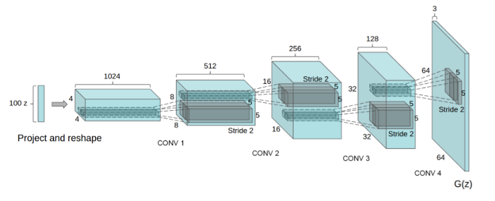   

The architecture basically consists of convolution layers which typically help in capturing the details of the images.  
**There are 5 major key points that make DCGAN different from conventional GANs, they are as follows:**  
- No spatial pooling 
- No fully connected layers
- Batch Normalization 
- ReLU activation function for the Generator network
- Leaky ReLU activation function for the discriminator network  

**Objective function**  
The objective function is what helps in realizing the end results. 

 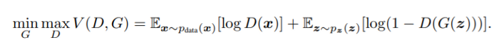  

Let us consider a Discriminator (D) that is trying to maximize V(D, G) and the Generator (G) is trying to minimize it. Let’s dive into the V(D, G). (x=real image, z=noise, D(x)=Probability of x being real ,G(z)=Generated image using z-noise). In case of the discriminator, when the real images are fed, D(x) should be higher (≈1) and D(G(z)) should be lower (≈0). Therefore D should be trained to make V(D, G) higher and on the other hand, when it comes to the generator, it tries to generate better images that are real-like. Therefore it tries to make D(G(z)) higher (≈1) which makes V(D, G) minimized.    
Results and more about DCGAN demonstration in respective section.  

## CNN based classifiers(on MNIST, CIFAR10 and CIFAR100)  
The general idea or the component used in CNN are the convolutional layers. Generally, in CNN, the set of images is first multiplied with the convolution kernel in a sliding window fashion, and then pooling is performed on the convoluted output and later on, the image is flattened and passed to the Linear layer for classification. **The usual steps for which are as follows**:  
- Convolution 
- Pooling 
- Activation function(Non-linear mostly)
- Flatten 
- Linear layer(aka. Dense or Fully connected layer) and classification   

### How convolutions work   

     

Learn more about convolutions [here](https://github.com/vdumoulin/conv_arithmetic)

**Various Layers and components involved in CNN architectures**  

1. Linear layer  
The transformation y = Wx + b is applied at the linear layer, where W is the weight, b is the bias, y is the desired output, and x is the input.  
2. Non-Linear activation functions  
<table>
 <tr>
    <td>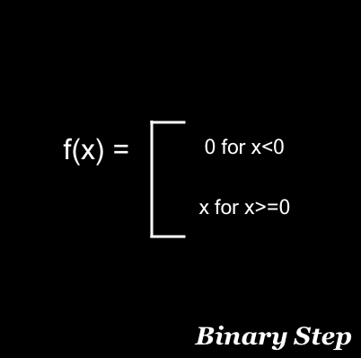</td>
    <td>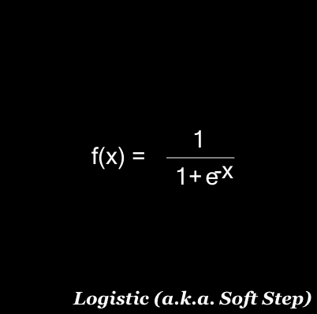</td>
   <td>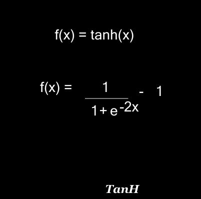</td>
 </tr>
</table>  
<table>
 <tr>
   <td>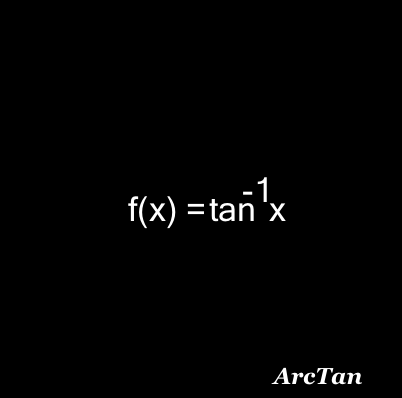</td>
   <td>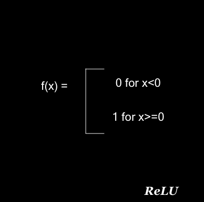</td>
   <td>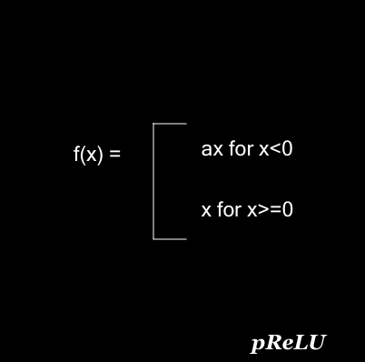</td>
 </tr>
</table> 
<table>
 <tr>
   <td>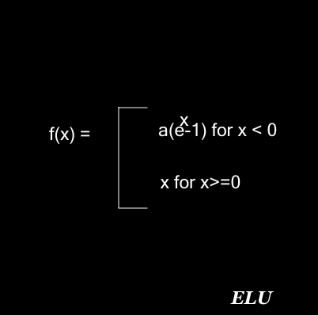</td>
   <td>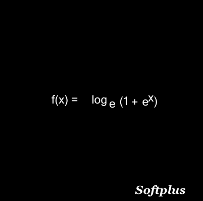</td>
   <td>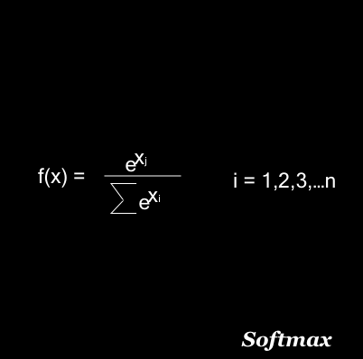</td>
 </tr>
</table> 
**Softmax** function squashes the outputs of each unit to be between 0 and 1, similar to the sigmoid function but here it also divides the outputs such that the total sum of all the outputs equals to 1.  
  
In this repository, we focus mainly on MNIST, CIFAR10, and CIFAR100 dataset for the training and classification.  
MNIST is a collection of handwritten digits 0 through 9, in grayscale. Meaning There are 10 classes of digits. Similarly, CIFAR10 adn CIFAR100 are datasets of common objects,animals etc, having 10 and 100 classses respectively. This means that  there are objects belonging to 10 and 100 classes to classify.  
**Hence we design a 10 class classifier for MNIST and CIFAR10 datasets while a 100 class classifier for CIFAR100 dataset.** 

3. Loss Functions  
Neural Network works in an iterative manner to get the optimum value for weights.For each iteration, a specific loss function is used to evaluate the error value. This loss function tells the model on how the errors should be calculated.  
Some of the loss functions are listed below  

 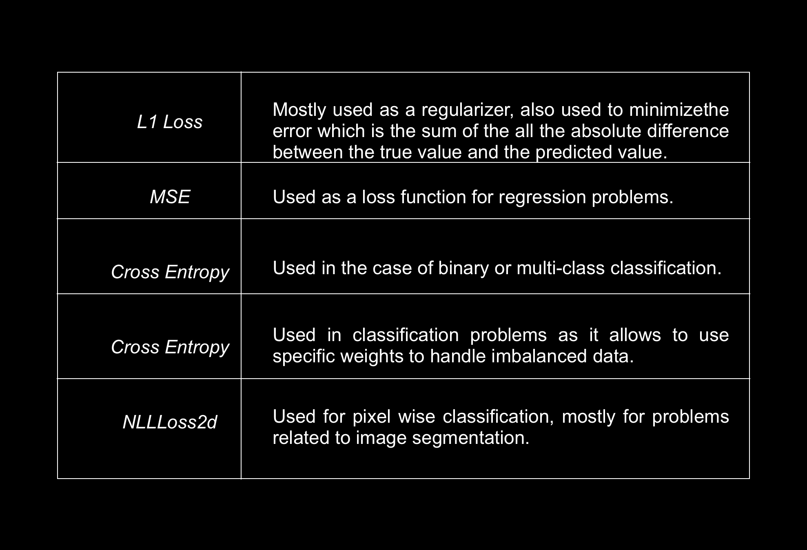  

4. Optimizers  
During the training process, we tweak and change the parameter of our model to try and minimize the loss function. The optimizers tie together the loss function and model parameters by updating the model in response to the output of the loss function. They shape and mold the model into its most accurate form. Loss function acts as a guide for the model to move in the right direction.  

 

## Convolutional Autoencoder    
Convolutional Autoencoder is a variant of Convolutional Neural Networks that are used as the tools for unsupervised learning of convolution filters. They are generally applied in the task of image reconstruction to minimize reconstruction errors by learning the optimal filters. Once they are trained in this task, they can be applied to any input in order to extract features. Convolutional Autoencoders are general-purpose feature extractors differently from general autoencoders that completely ignore the 2D image structure. In autoencoders, the image must be unrolled into a single vector and the network must be built following the constraint on the number of inputs.

The block diagram of a Convolutional Autoencoder is given in the below [figure.](https://www.researchgate.net/profile/Xifeng-Guo/publication/320658590/figure/fig1/AS:614154637418504@1523437284408/The-structure-of-proposed-Convolutional-AutoEncoders-CAE-for-MNIST-In-the-middle-there.png)  

 

**Note** All the networks were trained on Tesla T4 GPU under CUDA environment in [Google Colab](https://colab.research.google.com)  

## Transfer Learning using ResNet50 Architecture  

Transfer Learning gives us the ability to leverage the power of having a large dataset without having to retrain a new model from scratch. There needs to be some training done but this is mainly due to the part of adding in our new dataset. The idea behind Transfer Learning is to use a pre-trained network that has been trained on a large enough image dataset that can act as a generic model of the world around us. We can then use this trained network on the images that we want to classify, tweak the model, and run our new architecture to see the classification results that we are looking for. There are two ways to use pre-trained networks:

  1. Feature Extraction
  2. Fine-Tuning

The purpose of this experiment is to focus on the first option, feature extraction, and we will use the ImageNet architecture, ResNet50 as the pre-trained model. There are numerous transfer learning architectures that could be chosen such as VGG16, VGG19, MobileNet, etc. They all have their pros and cons for certain situations. For example, MobileNet is meant to be fast and flexible and works best on mobile devices. These models are trained on ImageNet dataset which contained 1.4 million labeled images and 1000 different classes. This is great given the fact that we might not have enough data to capture certain spacial features with our small dataset that we are looking to classify.   
The ResNet-50 model consists of 5 stages each with a convolution and Identity block. Each convolution block has 3 convolution layers and each identity block also has 3 convolution layers. The ResNet-50 has over 23 million trainable parameters.
An example of the ResNet50 architecture that was trained on ImageNet is shown below  

 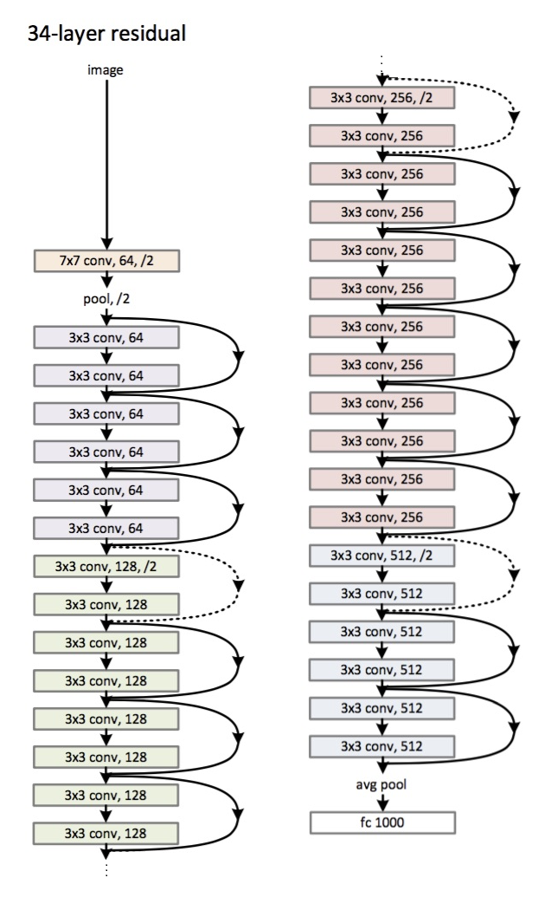

    

### Skip Connection     

In ResNet architecture, a “shortcut” or a “skip connection” allows the gradient to be directly backpropagated to earlier layers:  

 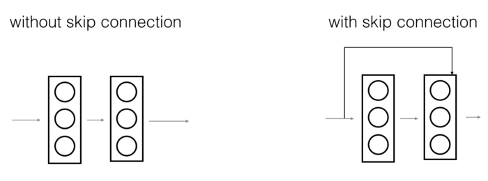

   

[Image source](https://towardsdatascience.com/understanding-and-coding-a-resnet-in-keras-446d7ff84d33)  
The image on the top shows the “main path” through the network. The image on the bottom adds a shortcut to the main path. By stacking these ResNet blocks on top of each other, you can form a very deep network.

There are two main types of blocks are used in a ResNet, depending mainly on whether the input/output dimensions are the same or different.  
1. Identity Block  
The identity block is the standard block used in ResNets and corresponds to the case where the input activation has the same dimension as the output activation.  

 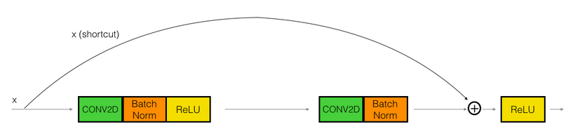

  
2. Convolutional Block   
   
We can use this type of block when the input and output dimensions don’t match up. The difference with the identity block is that there is a CONV2D layer in the shortcut path.  

 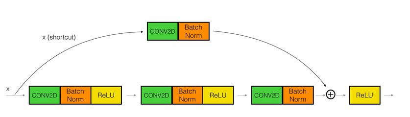

  
